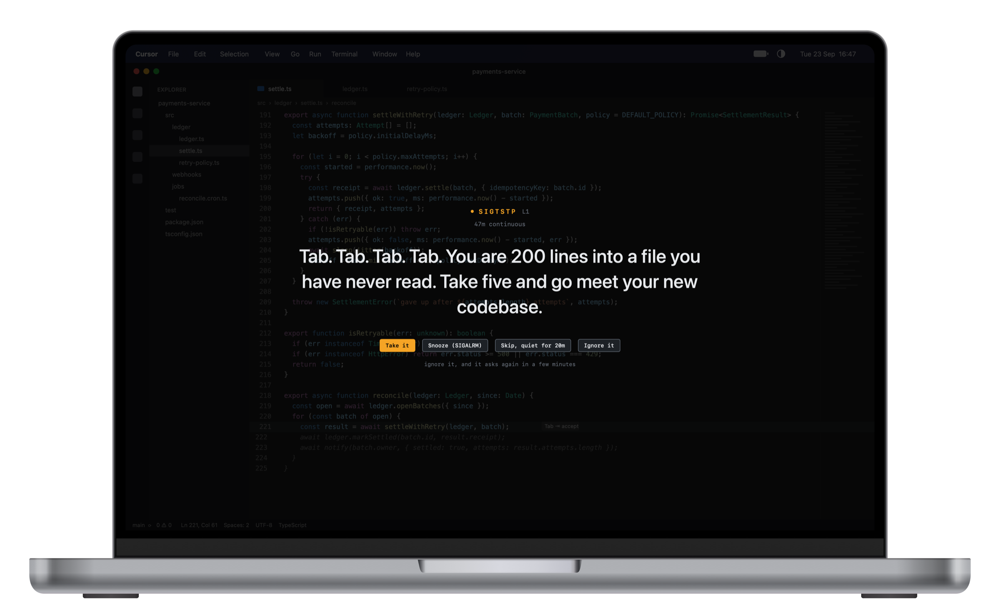
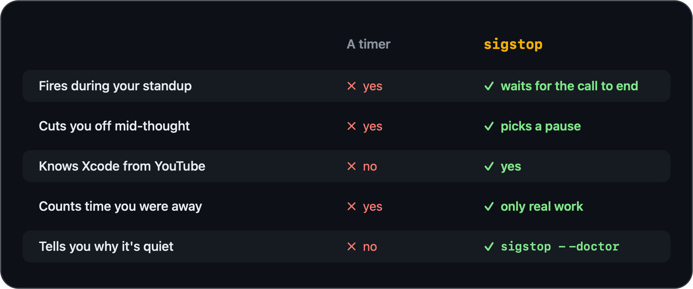
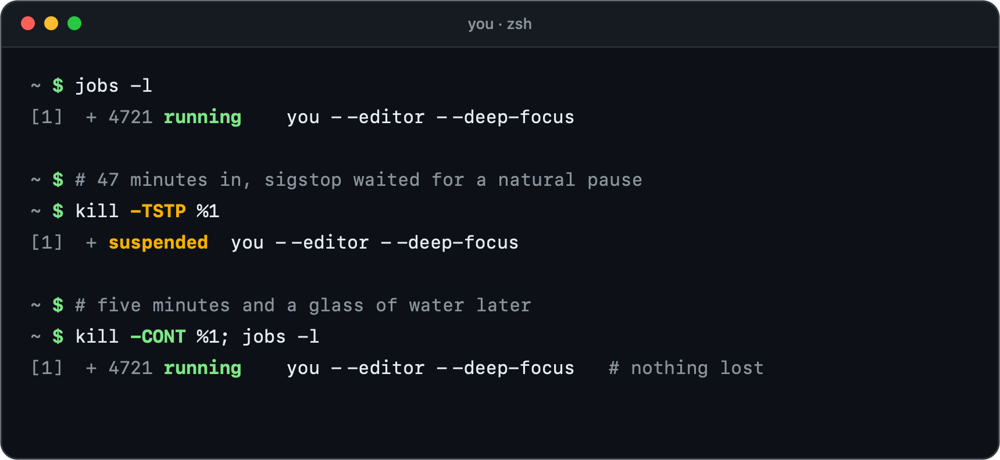
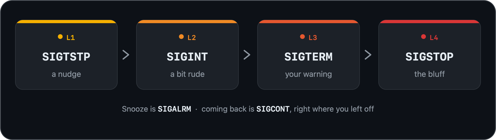

<div align="center">


# sigstop

**You're a developer. Not a server.**

Break reminders that know what you're doing, and when not to interrupt.

[](https://github.com/Mohamed-Elshesheny/sigstop/releases/latest/download/sigstop.dmg)

macOS 14+ · Apple Silicon and Intel · Free and open source · [Website](https://sigstop-app.vercel.app)

[](https://github.com/Mohamed-Elshesheny/sigstop/actions/workflows/ci.yml)
[](#build)
[](LICENSE)



</div>

## ✨ Not another timer

A timer fires in the middle of your standup. sigstop doesn't.



- 😏 **Speaks your language.** 187 lines for editors, terminals, browsers, AI tools and Xcode, in four tones from friendly to nuclear.
- 📊 **Shows your day.** Active time, your longest unbroken stretch and the breaks you kept.
- 🔋 **Barely there.** It sleeps between checks, so you won't notice it on your battery or in your Mac's speed.
- 🔒 **Private by design.** Zero permissions required, and nothing about you leaves your Mac.

## 🧭 How it works

You're a process. sigstop only stops you at a safe point, and you come back with everything intact.



Keep ignoring it and it asks a little louder, in signals your shell already knows. The last one claims it can't be ignored. It can.



<a id="install"></a>

## 📦 Install

1. [Download `sigstop.dmg`](https://github.com/Mohamed-Elshesheny/sigstop/releases/latest/download/sigstop.dmg)
2. Open it and drag **sigstop** into **Applications**
3. Clear the quarantine once (below), then open it

> [!IMPORTANT]
> sigstop isn't signed with a paid Apple Developer ID, so macOS blocks it the first time. That's expected, not a malware warning, and you only do it once.

**Recommended: Terminal**

```sh
xattr -dr com.apple.quarantine /Applications/sigstop.app
```

Then open sigstop as usual. It lives in your menu bar.

**Or: System Settings**

1. Open sigstop and close the warning
2. Go to **System Settings → Privacy & Security** and scroll down
3. Click **Open Anyway** and confirm (needs an admin account)

If **Open Anyway** isn't there, which happens when macOS calls the app "damaged", use the Terminal command.

To check the download wasn't corrupted, compare its checksum with the `sha256` on the [release page](https://github.com/Mohamed-Elshesheny/sigstop/releases/latest):

```sh
shasum -a 256 ~/Downloads/sigstop.dmg
```

That proves the file matches what GitHub serves, not who built it. For that, [build it yourself](#build).

**Updates:** Settings → About → **Check for updates**. Every update is checked against a signing key built into the app, from 0.1.8 on before it is even unpacked.

## 🔒 Privacy

- 👀 Reads **which** app is in front, never what's in it. No code, keystrokes, clipboard or screen.
- 🙅 **Needs zero permissions.** Accessibility (window titles and file paths) and your git branch are optional upgrades.
- 📡 **One request when you press Check for updates**, plus the download if you choose to install. No analytics, no account, no ID.
- 💾 **Stays on your Mac.** Raw events are deleted after 7 days; the daily totals per app stay until you delete them.

Don't take our word for it: `make verify` checks the network and privacy claims against an app you build yourself, and [PRIVACY.md](docs/PRIVACY.md) lists everything it stores.

## ❓ FAQ

<details>
<summary><b>macOS says sigstop "can't be opened", "could not verify" it, or that it's "damaged"</b></summary>
<br>

All three are the quarantine on an app without a paid Apple signature, not a malware warning. Run the Terminal command in [Install](#install) once.

</details>

<details>
<summary><b>It hasn't reminded me in a while. Is it broken?</b></summary>
<br>

Probably not. Ask it, and it tells you exactly why it's holding back:

```sh
/Applications/sigstop.app/Contents/MacOS/sigstop --doctor
```

</details>

<details>
<summary><b>It interrupted a call. How do I stop that?</b></summary>
<br>

Click **I'm in a meeting** in the menu bar. It holds breaks for up to two hours, or until you click **Not in a meeting**. The button is there while **Settings → Rhythm → Hold my break during calls** is on, which it is by default.

</details>

<details>
<summary><b>Does it read my code or what I type?</b></summary>
<br>

No. Out of the box it sees which app is in front, whether you're idle, and whether your mic or camera is on. Never keystrokes, clipboard or what's on screen. Window titles, file paths and your git branch are optional upgrades, and [PRIVACY.md](docs/PRIVACY.md) lists everything it stores.

</details>

<details>
<summary><b>Where is my data, and how do I delete it?</b></summary>
<br>

In `~/Library/Application Support/dev.sigstop.app`. **Settings → Data → Delete my data…** removes that folder and the login item. What the update check leaves behind is in the uninstall steps below.

</details>

<details>
<summary><b>How do I uninstall it?</b></summary>
<br>

If **Launch at login** is on, press **Settings → Data → Delete my data…** first, which also removes the login item. Then quit sigstop from the menu bar, drag it to the Trash, and remove what the update check left behind and any Accessibility permission you granted:

```sh
rm -rf ~/Library/Application\ Support/dev.sigstop.app
rm -rf ~/Library/Caches/dev.sigstop.app ~/Library/Caches/dev.sigstop.app.sparkle
rm -rf ~/Library/HTTPStorages/dev.sigstop.app ~/Library/HTTPStorages/dev.sigstop.app.binarycookies
defaults delete dev.sigstop.app
tccutil reset Accessibility dev.sigstop.app
```

</details>

<a id="build"></a>

## 🛠️ Build from source

Command Line Tools are enough. No Xcode.

```sh
git clone https://github.com/Mohamed-Elshesheny/sigstop
cd sigstop/app
make run     # build and launch
make test    # the test suite, no GUI needed
```

How it works is in [`docs/`](docs). Want to help? Start with [CONTRIBUTING.md](CONTRIBUTING.md).

## 📄 License

[GPL-3.0](LICENSE). The name and logo are not covered; see [TRADEMARK.md](TRADEMARK.md).
